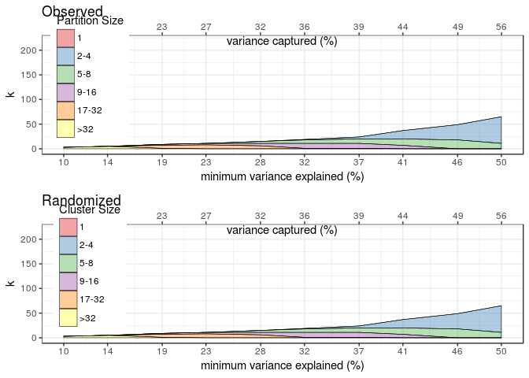

[](https://travis-ci.org/gvegayon/partition) [](https://ci.appveyor.com/api/projects/status/github//gvegayon/partition/?branch=master&svg=true) [](https://codecov.io/github/gvegayon/partition?branch=master)

<!-- README.md is generated from README.Rmd. Please edit that file -->
partition
=========

The goal of partition is to ...

Installation
------------

You can install partition from GitHub with:

``` r
# install.packages("devtools")
devtools::install_github("gvegayon/partition")
```

Example
-------

This is a basic example which shows you how to solve a common problem:

``` r
library(partition)

blk.vec = 2:20
c.lb = .2
c.ub = .4
n = 200

dat = sim_blk_diag_mvn( blk.vec, c.lb, c.ub, n  )

rslts = plot_dr( dat, method="PC1")
#> observed 2018-02-13 09:29:36 pct.var = 0.10
#> Percent variance explained: 0.10
#> observed 2018-02-13 09:29:38 pct.var = 0.14
#> Percent variance explained: 0.14
#> observed 2018-02-13 09:29:40 pct.var = 0.19
#> Percent variance explained: 0.19
#> observed 2018-02-13 09:29:41 pct.var = 0.23
#> Percent variance explained: 0.23
#> observed 2018-02-13 09:29:43 pct.var = 0.28
#> Percent variance explained: 0.28
#> observed 2018-02-13 09:29:45 pct.var = 0.32
#> Percent variance explained: 0.32
#> observed 2018-02-13 09:29:47 pct.var = 0.37
#> Percent variance explained: 0.37
#> observed 2018-02-13 09:29:49 pct.var = 0.41
#> Percent variance explained: 0.41
#> observed 2018-02-13 09:29:51 pct.var = 0.46
#> Percent variance explained: 0.46
#> observed 2018-02-13 09:29:54 pct.var = 0.50
#> Percent variance explained: 0.50
#> permuted 2018-02-13 09:29:56 pct.var=0.10
#> Percent variance explained: 0.10
#> permuted 2018-02-13 09:29:58 pct.var=0.14
#> Percent variance explained: 0.14
#> permuted 2018-02-13 09:30:00 pct.var=0.19
#> Percent variance explained: 0.19
#> permuted 2018-02-13 09:30:01 pct.var=0.23
#> Percent variance explained: 0.23
#> permuted 2018-02-13 09:30:03 pct.var=0.28
#> Percent variance explained: 0.28
#> permuted 2018-02-13 09:30:05 pct.var=0.32
#> Percent variance explained: 0.32
#> permuted 2018-02-13 09:30:07 pct.var=0.37
#> Percent variance explained: 0.37
#> permuted 2018-02-13 09:30:09 pct.var=0.41
#> Percent variance explained: 0.41
#> permuted 2018-02-13 09:30:12 pct.var=0.46
#> Percent variance explained: 0.46
#> permuted 2018-02-13 09:30:15 pct.var=0.50
#> Percent variance explained: 0.50
```


